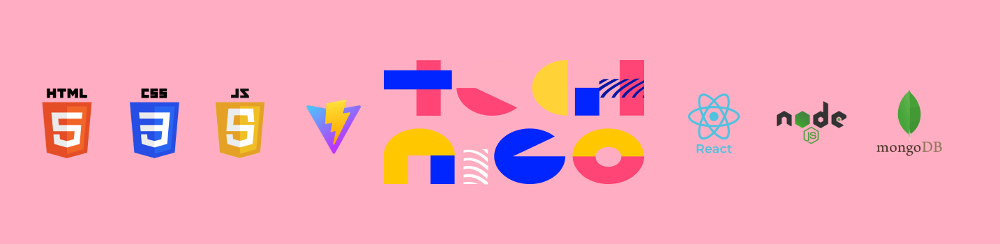

<h1 align="center">
  
</h1>
  

  Este repositorio sirve como una guia para la clase de FE Dev - Vue Conforcat. Done estaremos apendiendo acerca de HTML, CSS3, Javascript, Vue & Supabase.

 

 Built with ❤️ by Matilda Brunemalm, Theres Brännberg Lendt, Jennien Dalgren & Diego Zito

 Quote of the class

 Only the educated are free  - Epictetus

